# Diseño de interfaz de usuario

La aplicación **Conecta UAN** tendrá las siguientes pantallas, inspiradas en un sistema de mensajería institucional:

---

## 1. Pantalla de Inicio (Login)
Permite a los usuarios autenticarse con su correo institucional *@uan.edu.co* y contraseña.  
Incluye validaciones para dominio permitido y feedback de error.

---

## 2. Autenticación
Muestra el formulario de ingreso con campos de usuario y contraseña, asegurando acceso solo a miembros de la UAN.

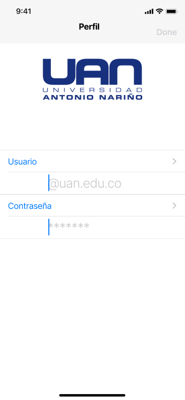

---

## 3. Lista de Chats
Pantalla principal con la lista de conversaciones activas. Cada ítem muestra foto, nombre, último mensaje y hora.  
Incluye acceso a chats archivados y búsqueda de contactos.

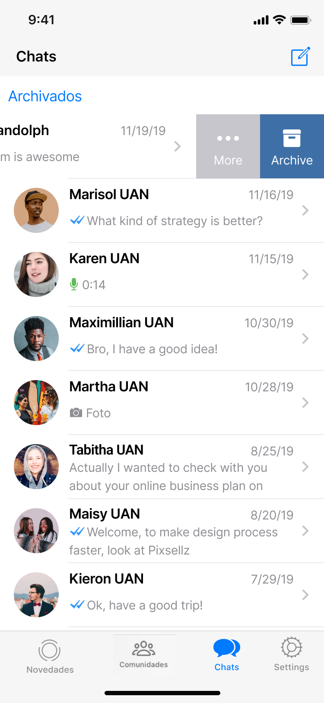

---

## 4. Acciones en Chats
Opciones rápidas como archivar, fijar, silenciar o eliminar conversaciones, accesibles desde gestos o menú contextual.

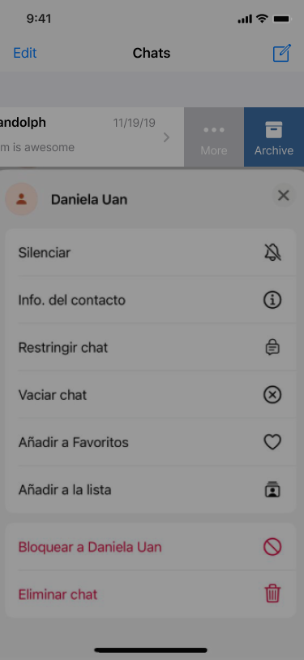

---

## 5. Chat Individual
Vista de conversación entre dos usuarios. Permite enviar texto, imágenes, documentos y audios.  
Los mensajes se muestran en burbujas con hora y estado de envío.

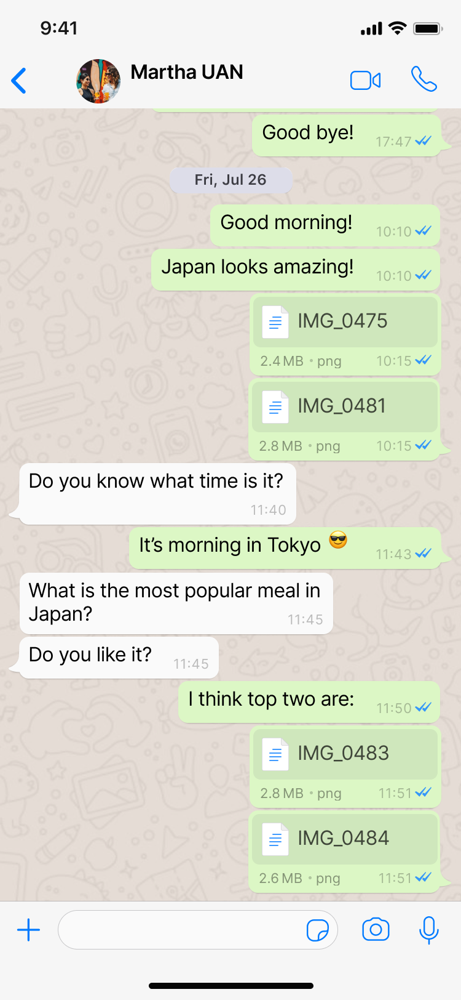

---

## 6. Opción de Adjuntar
Desde el chat individual, el usuario puede adjuntar fotos, videos, documentos o grabar audio.

---

## 7. Información de Contacto
Ficha de contacto con nombre, correo institucional, estado y archivos compartidos.  
Desde aquí se puede editar o eliminar el contacto.

---

## 8. Edición de Contacto
Formulario que permite modificar datos del contacto o añadir notas personalizadas.

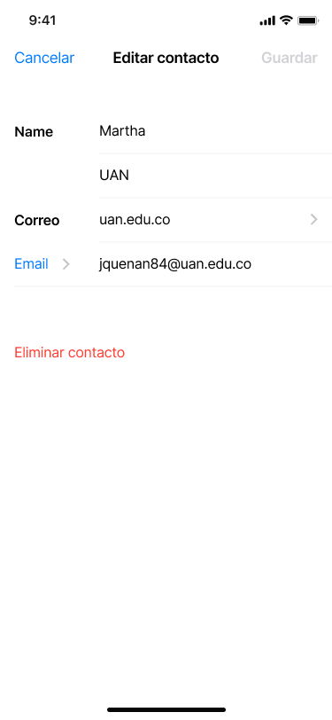

---

## 9. Editar Perfil
Pantalla para que el usuario actualice su nombre, foto de perfil y estado personal.

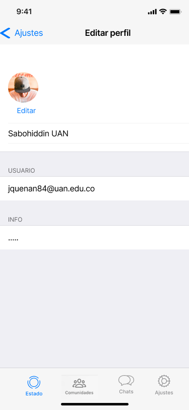

---

## 10. Estados (Status)
Espacio para publicar actualizaciones temporales en forma de texto, foto o video.  
Incluye controles de privacidad para elegir quién puede ver los estados.

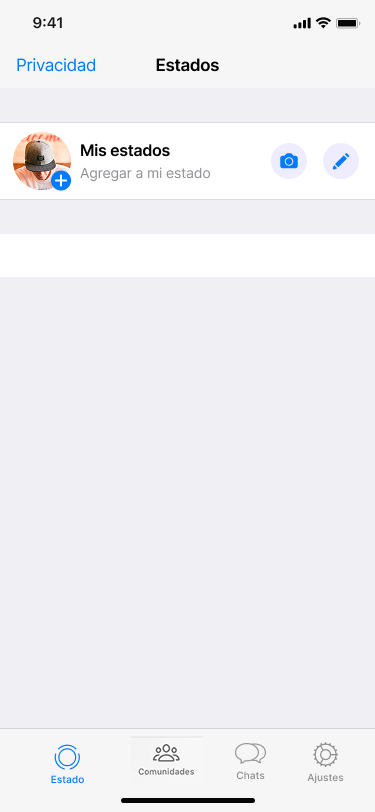

---

## 11. Estado individual
Detalle de un estado publicado por el usuario o sus contactos.

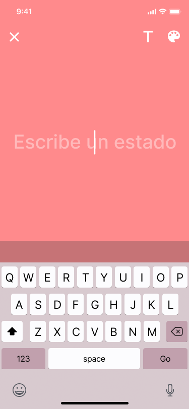

---

## 12. Configuración
Sección con múltiples categorías de ajustes: cuenta, notificaciones, almacenamiento, datos y ayuda.

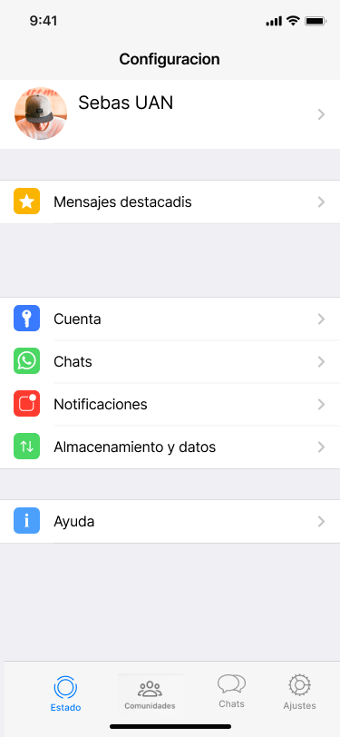

---

## 13. Notificaciones
Pantalla de configuración para activar/desactivar notificaciones de mensajes, grupos y sonidos personalizados.

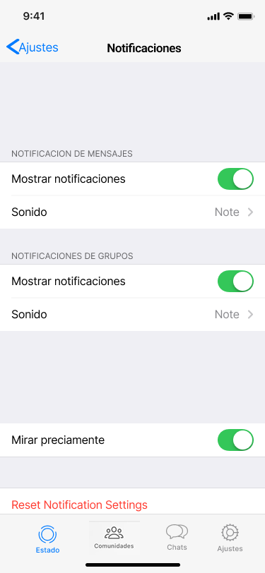

---

## 14. Almacenamiento y Datos
Opciones para controlar el consumo de datos, incluyendo descarga automática según conexión (Wi-Fi o datos móviles).

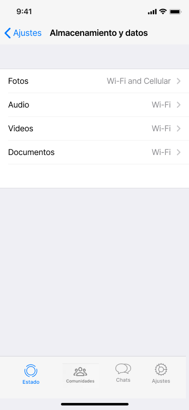

---

# Referencias

- [Dise;o de la app desde: figma](https://www.figma.com/design/C4joh67LYPsoHNfMiemkMZ/Conecta-UAN?node-id=0-8102&t=dHZUl6Eee8PHGrQ9-1)
- [Material Design: Foundations](https://m3.material.io/foundations)  
- [Material Design: Style](https://m3.material.io/styles)

